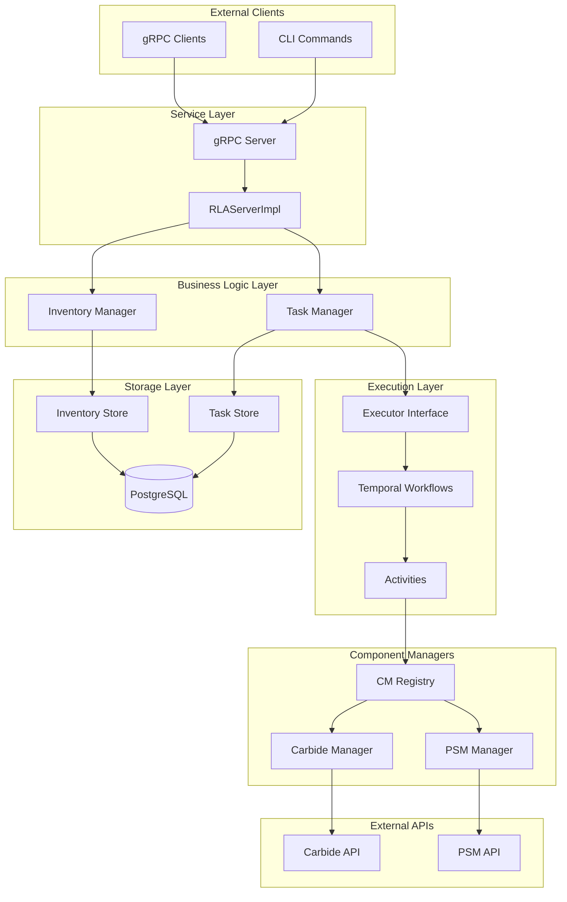
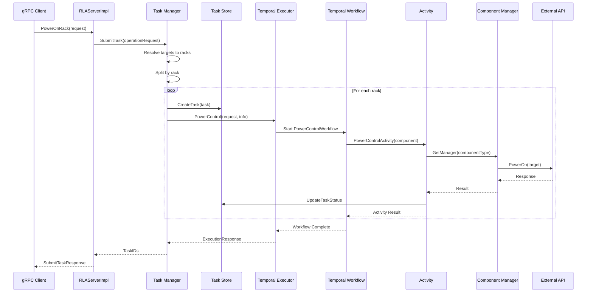
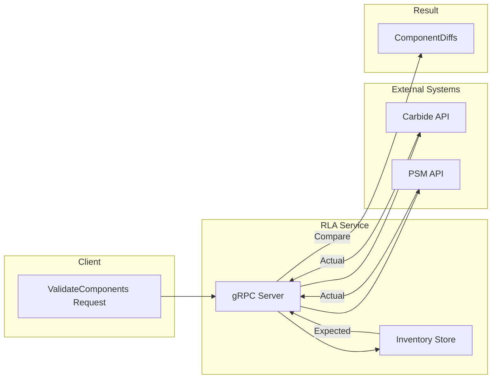

# RLA Service Architecture

This document describes the architecture of the RLA (Rack Level Administration) service, a gRPC-based system for managing rack-level assets in NVIDIA datacenters.

## Table of Contents

1. [Introduction](#introduction)
2. [High-Level Architecture](#high-level-architecture)
3. [Core Domain Model](#core-domain-model)
4. [Architecture Layers](#architecture-layers)
5. [Data Flows](#data-flows)
6. [External Integrations](#external-integrations)
7. [gRPC API Summary](#grpc-api-summary)
8. [Database Schema](#database-schema)
9. [Configuration](#configuration)

---

## Introduction

### What is RLA?

RLA (Rack Level Administration) is a service that provides a unified interface for managing rack-level assets in NVIDIA datacenters. It abstracts the complexity of interacting with various hardware components and external systems, providing a consistent API for inventory management and operations.

### Key Capabilities

- **Inventory Management**: Track and manage racks, components, and their configurations
- **Power Control**: Power on/off/reset operations for rack components
- **Firmware Management**: Firmware upgrades for compute nodes, switches, and power shelves
- **Component Validation**: Compare expected vs actual component states
- **NVL Domain Management**: Group racks into logical NVLink domains

### Design Principles

1. **1 Request → 1 TaskSpec**: Each operation gRPC request maps to one TaskSpec
2. **1 Rack → 1 Task**: Task Manager splits TaskSpec by rack for fault isolation and parallel execution
3. **Temporal Workflows**: Durable execution with automatic retries and observability
4. **Clean Architecture**: Clear separation between service, business logic, and storage layers

---

## High-Level Architecture



---

## Core Domain Model

### Rack

A physical rack unit containing multiple components. Each rack has:

- **DeviceInfo**: ID, name, manufacturer, model, serial number
- **Location**: Region, datacenter, room, position
- **Components**: List of components installed in the rack

### Component

Hardware components within a rack. Supported types:

| Type | Description | External System |
|------|-------------|-----------------|
| `Compute` | GPU compute trays | Carbide API |
| `NVLSwitch` | NVLink switches | Carbide API |
| `PowerShelf` | Power distribution units | PSM API |
| `TorSwitch` | Top-of-rack network switches | - |
| `UMS` | Unit Management System | - |
| `CDU` | Cooling Distribution Unit | - |

Each component has:

- **DeviceInfo**: ID, name, manufacturer, model, serial number
- **Position**: Slot ID, tray index, host ID within the rack
- **BMCs**: Board Management Controllers (Host BMC, DPU BMCs)
- **ComponentID**: External system identifier (e.g., Carbide machine_id)
- **FirmwareVersion**: Current firmware version

### NVL Domain

A logical grouping of racks that form an NVLink domain. Used for coordinating operations across multiple racks.

### Task

An asynchronous operation with lifecycle tracking:

- **TaskSpec**: Operation type and parameters
- **Status**: Pending → Running → Completed/Failed
- **ExecutionID**: Temporal workflow execution identifier
- **ComponentUUIDs**: Target components for the operation

---

## Architecture Layers

### Service Layer

**Location**: `internal/service/`

The service layer handles gRPC communication and coordinates between clients and the business logic layer.

**Key Components**:

- `service.go` - Service lifecycle management (start/stop), database connection, migrations
- `server_impl.go` - gRPC method implementations (`RLAServerImpl`)

**Responsibilities**:

- Accept and validate gRPC requests
- Convert between protobuf messages and internal domain objects
- Delegate operations to appropriate managers
- Handle mTLS authentication when configured

```go
type Service struct {
    conf             Config
    grpcServer       *grpc.Server
    pg               *postgres.Postgres
    inventoryManager inventorymanager.Manager
    taskStore        taskstore.Store
    taskManager      *taskmanager.Manager
}
```

### Business Logic Layer

#### Inventory Manager

**Location**: `internal/inventory/manager/`

Provides business logic for inventory operations including validation, caching, and audit logging.

**Interface**:

```go
type Manager interface {
    // Lifecycle
    Start(ctx context.Context) error
    Stop(ctx context.Context) error

    // Rack operations
    CreateExpectedRack(ctx context.Context, rack *rack.Rack) (uuid.UUID, error)
    GetRackByID(ctx context.Context, id uuid.UUID, withComponents bool) (*rack.Rack, error)
    GetRackBySerial(ctx context.Context, manufacturer, serial string, withComponents bool) (*rack.Rack, error)
    PatchRack(ctx context.Context, rack *rack.Rack) (string, error)
    // ... additional methods

    // Component operations
    GetComponentByID(ctx context.Context, id uuid.UUID) (*component.Component, error)
    GetComponentByBMCMAC(ctx context.Context, macAddress string) (*component.Component, error)
    // ... additional methods

    // NVL Domain operations
    CreateNVLDomain(ctx context.Context, nvlDomain *nvldomain.NVLDomain) (uuid.UUID, error)
    AttachRacksToNVLDomain(ctx context.Context, nvlDomainID, rackIDs []identifier.Identifier) error
    // ... additional methods
}
```

#### Task Manager

**Location**: `internal/task/manager/`

Orchestrates asynchronous operations by resolving targets, splitting by rack, and executing via Temporal workflows.

**Key Responsibilities**:

1. Resolve operation targets (rack IDs, names, component IDs) to concrete components
2. Split multi-rack requests into individual per-rack tasks
3. Create task records in the database
4. Execute tasks via the Executor interface
5. Track task status updates

```go
func (m *Manager) SubmitTask(ctx context.Context, req *operation.Request) ([]uuid.UUID, error) {
    // 1. Resolve targets to racks with components
    rackMap, err := resolveTargetSpecToRacks(ctx, m.inventoryStore, &req.TargetSpec)
    
    // 2. Create and execute task for each rack
    for _, targetRack := range rackMap {
        taskID, err := m.createAndExecuteTask(ctx, req, targetRack)
        taskIDs = append(taskIDs, taskID)
    }
    
    return taskIDs, nil
}
```

### Storage Layer

#### Inventory Store

**Location**: `internal/inventory/store/`

Defines the interface for inventory data persistence.

```go
type Store interface {
    // Lifecycle
    Start(ctx context.Context) error
    Stop(ctx context.Context) error

    // Rack operations
    CreateExpectedRack(ctx context.Context, rack *rack.Rack) (uuid.UUID, error)
    GetRackByID(ctx context.Context, id uuid.UUID, withComponents bool) (*rack.Rack, error)
    // ...

    // Component operations
    GetComponentByID(ctx context.Context, id uuid.UUID) (*component.Component, error)
    // ...

    // NVL Domain operations
    CreateNVLDomain(ctx context.Context, nvlDomain *nvldomain.NVLDomain) (uuid.UUID, error)
    // ...
}
```

**Implementation**: `postgres.go` - PostgreSQL-based implementation

#### Task Store

**Location**: `internal/task/store/`

Persists task state and status updates.

```go
type Store interface {
    CreateTask(ctx context.Context, task *task.Task) error
    UpdateTaskStatus(ctx context.Context, update *task.TaskStatusUpdate) error
    GetTasks(ctx context.Context, taskIDs []uuid.UUID) ([]*task.Task, error)
    ListTasks(ctx context.Context, options *TaskListOptions, pagination *Pagination) ([]*task.Task, int32, error)
}
```

### Execution Layer

**Location**: `internal/task/executor/`

Provides an abstraction for task execution backends.

```go
type Executor interface {
    Start(ctx context.Context) error
    Stop(ctx context.Context) error
    Type() common.ExecutorType
    PowerControl(ctx context.Context, req *task.ExecutionRequest, info operations.PowerControlTaskInfo) (*task.ExecutionResponse, error)
    FirmwareControl(ctx context.Context, req *task.ExecutionRequest, info operations.FirmwareControlTaskInfo) (*task.ExecutionResponse, error)
    InjectExpectation(ctx context.Context, req *task.ExecutionRequest, info operations.InjectExpectationTaskInfo) (*task.ExecutionResponse, error)
    CheckStatus(ctx context.Context, executionID string) (common.TaskStatus, error)
}
```

#### Temporal Workflow Manager

**Location**: `internal/task/executor/temporalworkflow/manager/`

Implements the Executor interface using Temporal workflows for durable execution.

**Key Features**:

- Workflow-based execution for automatic retries and fault tolerance
- Fan-out activities per component within a rack
- Status tracking via Temporal workflow queries

**Workflow Types**:

- `PowerControlWorkflow` - Power on/off/reset operations
- `FirmwareControlWorkflow` - Firmware upgrade/downgrade
- `InjectExpectationWorkflow` - Push expected state to external systems

### Component Manager Layer

**Location**: `internal/task/componentmanager/`

Provides pluggable implementations for component-specific operations.

See [Component Manager Architecture](component-manager-architecture.md) for detailed documentation.

**Key Patterns**:

- **Provider Pattern**: Wraps API clients and manages their lifecycle
- **Factory Pattern**: Creates component manager instances with required dependencies
- **Registry Pattern**: Maps component types to implementations

```go
type ComponentManager interface {
    Type() devicetypes.ComponentType
    InjectExpectation(ctx context.Context, target common.Target, info operations.InjectExpectationTaskInfo) error
    PowerControl(ctx context.Context, target common.Target, info operations.PowerControlTaskInfo) error
    FirmwareControl(ctx context.Context, target common.Target, info operations.FirmwareControlTaskInfo) error
}
```

**Implementations**:

| Component Type | Implementation | Provider |
|----------------|----------------|----------|
| Compute | `compute/carbide/` | Carbide |
| NVLSwitch | `nvlswitch/carbide/` | Carbide |
| PowerShelf | `powershelf/psm/` | PSM |

---

## Data Flows

### Inventory Population Flow

Inventory is populated via the gRPC API using `CreateExpectedRack` and `AddComponent` calls. Users construct their own data and call these APIs directly.

### Task Execution Flow



### Component Validation Flow



---

## External Integrations

### Carbide API

**Location**: `internal/carbideapi/`

Carbide is NVIDIA's hardware management platform for compute nodes and switches.

**Used for**:

- Machine discovery and status
- Power control (on/off/reset)
- Firmware management
- Position and health information

**Client Interface**:

```go
type Client interface {
    Version(ctx context.Context) (string, error)
    GetMachines(ctx context.Context) ([]MachineInfo, error)
    FindMachinesByIds(ctx context.Context, ids []string) ([]MachineDetail, error)
    GetPowerStates(ctx context.Context, machineIDs []string) ([]MachinePowerState, error)
    PowerOn(ctx context.Context, machineIDs []string) ([]PowerControlResult, error)
    // ...
}
```

### PSM API (Powershelf Manager)

**Location**: `internal/psmapi/`

PSM runs as a sidecar container in the RLA pod, managing power shelf units.

**Used for**:

- Powershelf registration
- Power control for PSUs
- Firmware management
- Health and status monitoring

**Configuration**: `PSM_API_URL` environment variable (default: `localhost:50052`)

### Temporal

**Location**: `internal/clients/temporal/`

Temporal provides durable workflow execution for long-running operations.

**Configuration**:

- `TEMPORAL_HOST` - Temporal server hostname
- `TEMPORAL_PORT` - Temporal server port (default: 7233)
- `TEMPORAL_NAMESPACE` - Workflow namespace (default: `rla`)

---

## gRPC API Summary

**Proto Definition**: `internal/proto/v1/rla.proto`

### Inventory APIs

| Method | Description |
|--------|-------------|
| `CreateExpectedRack` | Create a new expected rack configuration |
| `PatchRack` | Update existing rack with new component data |
| `GetRackInfoByID` | Get rack by UUID |
| `GetRackInfoBySerial` | Get rack by manufacturer + serial |
| `GetListOfRacks` | List racks with filtering and pagination |
| `GetComponentInfoByID` | Get component by UUID |
| `GetComponentInfoBySerial` | Get component by manufacturer + serial |

### NVL Domain APIs

| Method | Description |
|--------|-------------|
| `CreateNVLDomain` | Create a new NVL domain |
| `AttachRacksToNVLDomain` | Associate racks with an NVL domain |
| `DetachRacksFromNVLDomain` | Remove racks from NVL domain |
| `GetListOfNVLDomains` | List NVL domains |
| `GetRacksForNVLDomain` | Get all racks in an NVL domain |

### Operation APIs

| Method | Description |
|--------|-------------|
| `PowerOnRack` | Power on rack components |
| `PowerOffRack` | Power off rack components (graceful/forced) |
| `PowerResetRack` | Restart rack components |
| `UpgradeFirmware` | Upgrade firmware on components |

### Query APIs

| Method | Description |
|--------|-------------|
| `GetExpectedComponents` | Get expected component state from local DB |
| `GetActualComponents` | Get actual component state from external systems |
| `ValidateComponents` | Compare expected vs actual, return diffs |
| `ListTasks` | List tasks with filtering |
| `GetTasksByIDs` | Get specific tasks by UUID |

### Target Specification

Operations use `OperationTargetSpec` for flexible targeting:

```protobuf
message OperationTargetSpec {
    oneof targets {
        RackTargets racks = 1;       // Target entire racks (with optional type filter)
        ComponentTargets components = 2;  // Target specific components
    }
}

message RackTarget {
    oneof identifier {
        string id = 1;      // Rack UUID
        string name = 2;    // Rack name
    }
    repeated ComponentType component_types = 3;  // Optional type filter
}

message ComponentTarget {
    oneof identifier {
        string uuid = 1;           // RLA internal UUID
        ExternalRef external = 2;  // External system reference
    }
}
```

---

## Database Schema

**Migrations Location**: `pkg/db/migrations/`

### Key Tables

#### `racks`

Stores rack information including device info and location.

| Column | Type | Description |
|--------|------|-------------|
| `id` | UUID | Primary key |
| `name` | VARCHAR | Rack name |
| `manufacturer` | VARCHAR | Manufacturer name |
| `serial_number` | VARCHAR | Serial number |
| `region` | VARCHAR | Geographic region |
| `datacenter` | VARCHAR | Datacenter code |
| `room` | VARCHAR | Room identifier |
| `position` | VARCHAR | Physical position |
| `nvl_domain_id` | UUID | Foreign key to nvl_domains |

#### `components`

Stores component information within racks.

| Column | Type | Description |
|--------|------|-------------|
| `id` | UUID | Primary key |
| `rack_id` | UUID | Foreign key to racks |
| `type` | INT | Component type enum |
| `name` | VARCHAR | Component name |
| `manufacturer` | VARCHAR | Manufacturer |
| `serial_number` | VARCHAR | Serial number |
| `firmware_version` | VARCHAR | Current firmware |
| `slot_id` | INT | Rack slot position |
| `tray_idx` | INT | Tray index |
| `host_id` | INT | Host ID |
| `component_id` | VARCHAR | External system ID |
| `external_id` | VARCHAR | Alternative external ID |

#### `bmcs`

Stores BMC (Board Management Controller) information for components.

| Column | Type | Description |
|--------|------|-------------|
| `id` | UUID | Primary key |
| `component_id` | UUID | Foreign key to components |
| `type` | INT | BMC type (Host, DPU) |
| `mac_address` | VARCHAR | MAC address |
| `ip_address` | VARCHAR | IP address |

#### `nvl_domains`

Stores NVL domain definitions.

| Column | Type | Description |
|--------|------|-------------|
| `id` | UUID | Primary key |
| `name` | VARCHAR | Domain name |

#### `tasks`

Stores task execution records.

| Column | Type | Description |
|--------|------|-------------|
| `id` | UUID | Primary key |
| `operation` | JSONB | Operation type and parameters |
| `rack_id` | UUID | Target rack |
| `component_uuids` | UUID[] | Target components |
| `description` | VARCHAR | Task description |
| `executor_type` | INT | Executor type enum |
| `execution_id` | VARCHAR | Temporal workflow ID |
| `status` | INT | Task status enum |
| `message` | TEXT | Status message |
| `created_at` | TIMESTAMP | Creation time |
| `updated_at` | TIMESTAMP | Last update time |

---

## Configuration

### Environment Variables

#### Database

| Variable | Description | Default |
|----------|-------------|---------|
| `DB_ADDR` | PostgreSQL host | - |
| `DB_PORT` | PostgreSQL port | 5432 |
| `DB_USER` | Database user | - |
| `DB_PASSWORD` | Database password | - |
| `DB_DATABASE` | Database name | - |

#### Temporal

| Variable | Description | Default |
|----------|-------------|---------|
| `TEMPORAL_HOST` | Temporal server host | - |
| `TEMPORAL_PORT` | Temporal server port | 7233 |
| `TEMPORAL_NAMESPACE` | Workflow namespace | rla |

#### PSM

| Variable | Description | Default |
|----------|-------------|---------|
| `PSM_API_URL` | PSM sidecar URL | localhost:50052 |

### Component Manager Configuration

**File**: `configs/componentmanager.prod.yaml` (or set via `COMPONENT_MANAGER_CONFIG`)

```yaml
component_managers:
  compute: carbide
  nvlswitch: carbide
  powershelf: psm

providers:
  carbide:
    timeout: "1m"
  psm:
    timeout: "30s"
```

See [Component Manager Configuration](component-manager-config.md) for details.

### CLI Flags

```bash
rla serve [flags]

Flags:
  -p, --port int              Port for the gRPC server (default 50051)
  -c, --component-config str  Path to component manager config file
```

---

## Directory Structure

```
rla/
├── cmd/                          # CLI commands
│   ├── root.go                   # Root command
│   ├── serve.go                  # Server startup
│   ├── inventory.go              # Inventory commands
│   └── ...
├── configs/                      # Configuration files
│   └── componentmanager.*.yaml
├── docs/                         # Documentation
├── internal/
│   ├── service/                  # gRPC service layer
│   │   ├── service.go
│   │   └── server_impl.go
│   ├── inventory/                # Inventory management
│   │   ├── manager/              # Business logic
│   │   ├── store/                # Storage layer
│   │   └── objects/              # Domain objects
│   │       ├── rack/
│   │       ├── component/
│   │       ├── bmc/
│   │       └── nvldomain/
│   ├── task/                     # Task management
│   │   ├── manager/              # Task orchestration
│   │   ├── store/                # Task storage
│   │   ├── executor/             # Execution backends
│   │   │   └── temporalworkflow/
│   │   ├── componentmanager/     # Component-specific operations
│   │   └── operations/           # Operation definitions
│   ├── carbideapi/               # Carbide client
│   ├── psmapi/                   # PSM client
│   ├── clients/                  # External clients
│   │   └── temporal/
│   └── proto/v1/                 # Protobuf definitions
├── pkg/
│   ├── client/                   # Go client library
│   ├── common/                   # Shared types
│   ├── converter/                # Type converters
│   └── db/                       # Database utilities
│       ├── migrations/
│       └── postgres/
└── scripts/                      # Utility scripts
```

---

## Related Documentation

- [Component Manager Architecture](component-manager-architecture.md)
- [Component Manager Configuration](component-manager-config.md)
- [gRPC API Reference](grpc-api.md)
